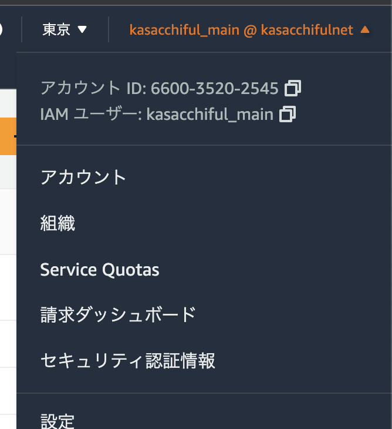
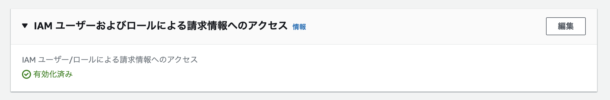
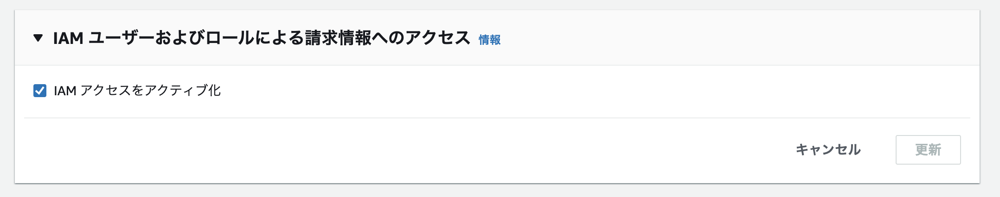

# 最初に設定しておくと良い項目

今回は個人アカウントに絞って、無料の範囲で最初に設定しておくと良い項目をあげております。

## 流れ

1. AWSアカウントにMFAを設定する
2. IAMユーザでも請求情報を見れるようにする
3. 支払い通貨を日本円にする
4. Budgetsを設定する
5. パスワードポリシーを設定する
6. アカウントエイリアスを設定する
7. Trusted Advisorを確認する

## AWSアカウントにMFAを設定する

以下のページを参考に、AWSアカウントにMFAを設定しましょう。
事前に、各自のスマートフォンに以下のようなMFA管理アプリをインストールしておいてください。

- Google Authenticator
- Authy

1. AWSマネジメントコンソールにAWSアカウントでログインします。
2. 右上のアカウント名から「セキュリティ認証情報」メニューをクリックします。
    - 
3. 「多要素認証 (MFA)」から「MFAデバイスの割り当て」をクリックします。
4. MFAデバイス名を適宜入力した後、「認証アプリケーション」を選択して進みます。
5. 画面の指示に従ってMFAを設定します。

AWSアカウントだけでなく、今回作成したAdministratorAccess権限を持つIAMユーザにも同様にMFAを設定すると良いでしょう。

## IAMユーザでも請求情報を見れるようにする

以下のページを参考に、AWSアカウントで操作しましょう。

https://dev.classmethod.jp/articles/show-your-aws-billing-info-to-iam-users/

1. AWSマネジメントコンソールにAWSアカウントでログインします。
2. 右上のアカウント名から「アカウント」メニューをクリックします。
    - 
3. 「IAM ユーザーおよびロールによる請求情報へのアクセス」から「編集」ボタンをクリックします。
    - 
4. 「IAM アクセスをアクティブ化」にチェックを入れ、「更新」ボタンをクリックします。
    - 
5. 「有効化済み」になっていることを確認します。

以降は、AWSアカウントをログアウトして、IAMユーザでログインして操作しましょう。

## 支払い通貨を日本円にする

デフォルトでは、支払い通貨は米国ドルです。
日本円に変更することができます。

1. AWSマネジメントコンソールにIAMユーザでログインします。
2. 右上のアカウント名から「請求ダッシュボード」メニューをクリックします。
    - 
3. 左側メニューの「お支払いの詳細設定」をクリックし、「編集」をクリックします。
4. 支払い通貨を「JPY - 日本円」に変更して、「変更の保存」をクリックします。

## Budgetsを設定する

想定を超えるAWS利用料を消費することを事前に察知しておくと、無駄な費用を抑えることができるようになります。

以下のページを参考にして、Budgetsを設定してみましょう。

https://dev.classmethod.jp/articles/aws-budgets-tutorial/

1. AWSマネジメントコンソールにIAMユーザでログインします。
2. 右上のアカウント名から「請求ダッシュボード」メニューをクリックします。
    - 
3. 左側メニューの「budgets」をクリックし、「予算を作成」をクリックします。
4. 画面の指示に従って、「シンプルなテンプレート」を用いて「月次のコスト予算」を設定してみましょう。

## パスワードポリシーを設定する

パスワードポリシーを強化します。
ここでのパスワードポリシーは、IAMユーザに適用されます。

1. AWSマネジメントコンソールで「サービス」から「IAM」をクリックします。
    - Identity and Access Managementのダッシュボード画面が表示されます。
2. 左側メニューの「アカウント設定」をクリックし、「パスワードポリシーの編集」ボタンをクリックします。
3. 以下の設定をして、「変更を保存」ボタンをクリックします。
    - パスワードの最小文字数: 8以上の大きめの数字を入れる
    - パスワードの強度: 全項目にチェックを入れる
        - 少なくとも 1 つのアルファベットの大文字 (A～Z) が必要です
        - 少なくとも 1 つのアルファベットの小文字 (a～z) が必要です
        - 少なくとも 1 つの数字が必要です
        - 少なくとも 1 つの英数字以外の文字が必要です (! @ # $ % ^ & * ( ) _ + - = [ ] {} | ')
    - その他の要件: 適宜設定する
        - 今回は「ユーザーにパスワードの変更を許可」だけチェックを入れる

## アカウントエイリアスを設定する

アカウントエイリアスを設定しておくと、IAMユーザでログインする際、AWSアカウントID以外にアカウントエイリアスでログインすることができます。

1. AWSマネジメントコンソールで「サービス」から「IAM」をクリックします。
    - Identity and Access Managementのダッシュボード画面が表示されます。
2. ダッシュボード画面右のAWSアカウント欄の「アカウントエイリアス」の「編集」をクリックします。
3. 適宜エイリアス文字列を設定します。

## Trusted Advisorを確認する

Trusted Advisorは5つの観点から、AWSがアカウント内の状況をチェックし推奨設定を教えてくれるサービスです。
無料のAWSサポートプランである「ペーシックプラン」では、一部の項目しかチェックしてくれませんが、適宜チェックしておくと良いです。
メール通知を設定しておくと、定期的に推奨設定を通知してくれますので、適宜通知設定をしておきましょう。

## 他にも実は確認しておいた方が良いものもある

今回はここまでの設定で終了しますが、
例えば企業で利用するAWSアカウントの場合、有料サービスを使ってでもあらかじめ設定しておくと良い項目があります。

以下のページを参考にして、適切な設定を行ってください。

https://dev.classmethod.jp/articles/aws-1st-step-2021/
