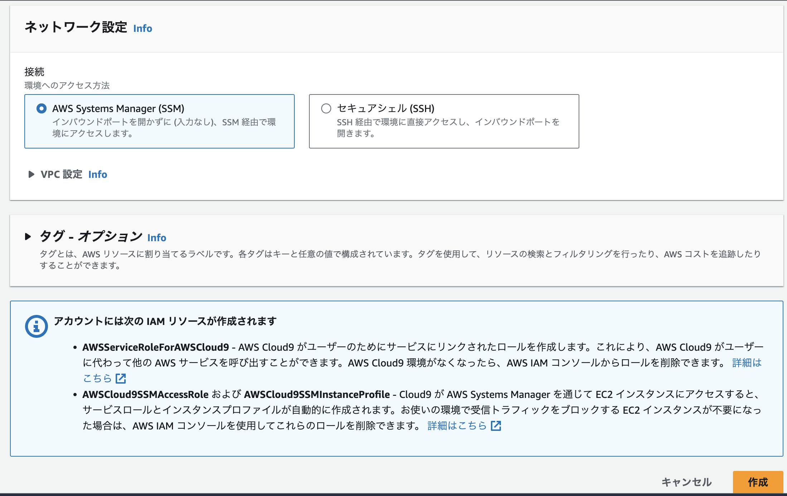

# Cloud9ワークスペースの作成

ここでは、Cloud9ワークスペースを作成します。
以降の作業は全て東京リージョンで行います。

マネジメントコンソール上で、東京リージョンが選択されているか、確認ください。

## Cloud9ワークスペースの作成

- AWSマネジメントコンソールから、Cloud9のページに遷移します。
    - https://ap-northeast-1.console.aws.amazon.com/cloud9/home?region=ap-northeast-1

- 「環境を作成」をクリックします。

- 以下適宜設定します。
    - 名前: 適宜設定します
    - 環境タイプ: 新しいEC2インスタンス (デフォルト)
        - インスタンスタイプ: t3.small
    - ネットワーク設定: デフォルトのまま
- 設定後「作成」をクリックします。

- Cloud9ワークスペースの一覧画面に遷移します。
    - ワークスペース作成完了するまで、しばらくお待ちください。

- 正常に作成されたら、Cloud9 IDEの「開く」をクリックします。

- しばらくすると、Cloud9のIDE画面が起動します。

## ディスクボリュームの拡張

デフォルトでは、Cloud9インスタンスのディスクボリュームサイズが10GiBです。
今回は30GiBまで拡張して使用したいと思います。

- Cloud9ワークスペース一覧画面から、作成済みのワークスペース環境の名前をクリックします。

- 「EC2インスタンスの管理」をクリックします。

- 表示されているEC2インスタンスの左側チェックボックスにチェックを入れ、下部の「ストレージ」タブをクリックした後、「ボリュームID」をクリックします。

- 表示されているボリュームの左側チェックボックスにチェックを入れ、「アクション」から「ボリュームの変更」をクリックします。

- サイズを「30」に変更して、「変更」ボタンをクリックします。

- 再度「変更」ボタンをクリックします。

- 変更リクエストが受付されました。Cloud9が起動するEC2インスタンスを再起動することで反映されます。

- 変更対象となるボリュームの左側チェックボックスにチェックを入れ、「詳細」タブの「アタッチされたインスタンス」をクリックします。

- 表示されているEC2インスタンスの左側チェックボックスにチェックを入れ、「インスタンスの状態」から「インスタンスを再起動」をクリックします。

- 「再起動」ボタンをクリックします。

- 再起動後、ストレージボリュームサイズが30GiBになっています。

- Cloud9ワークスペースに戻りましょう。もしワークスペースを開きっぱなしでボリュームサイズ変更している場合は、Webブラウザを再読み込みします。

- Cloud9からも、ルートディレクトリの容量が増えていることが確認できると思います。

次の章では、Cloud9ワークスペースに必要な権限を付与するために、
IAMロールの作成を行います。
