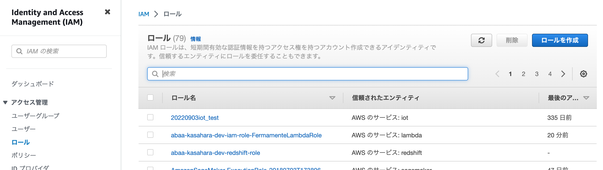
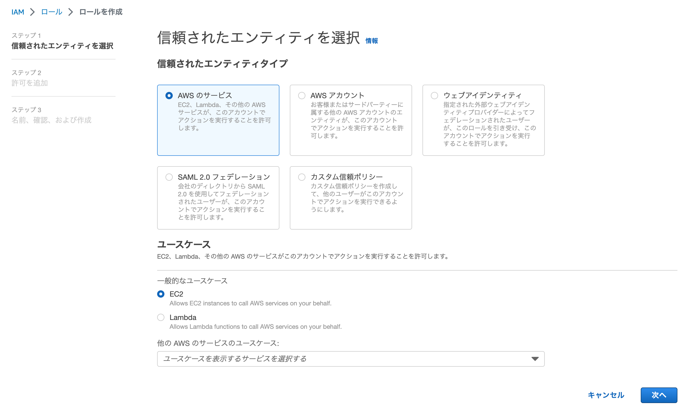
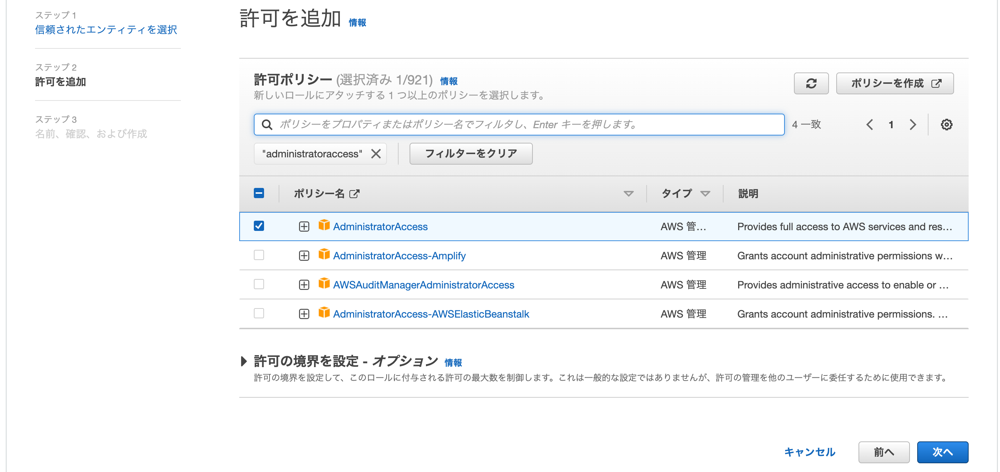
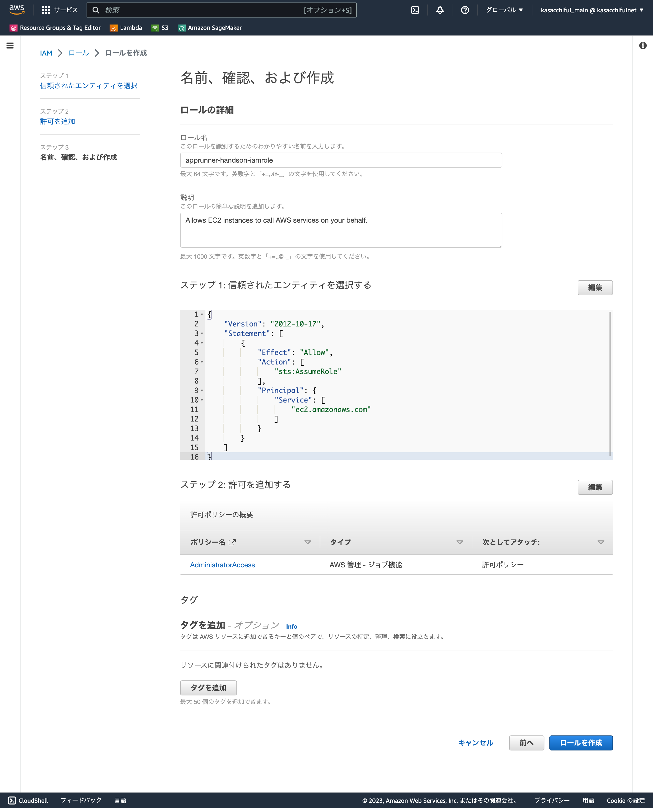
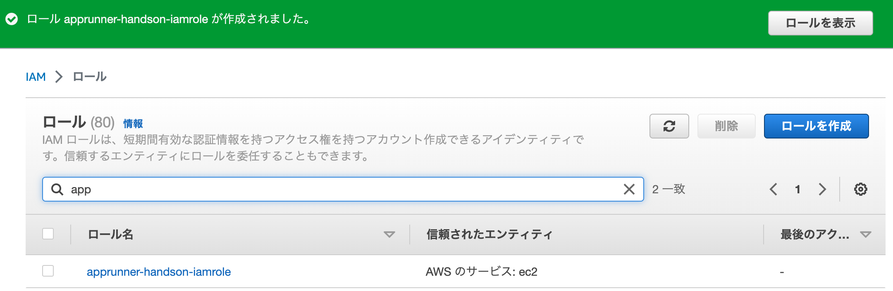
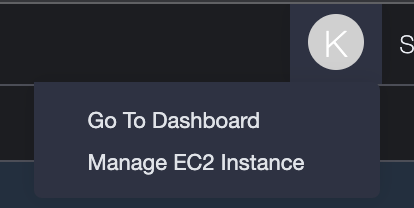
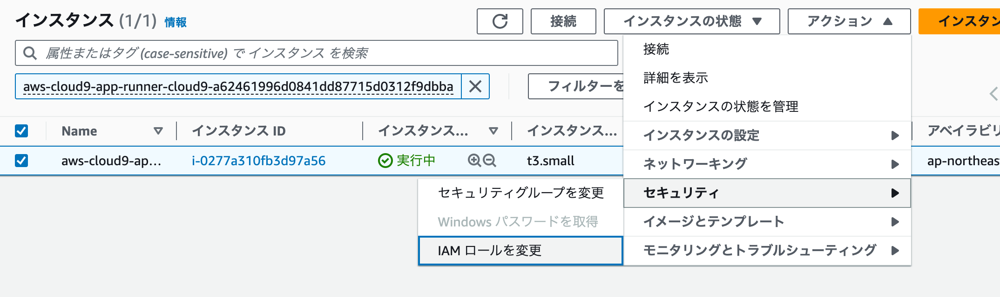
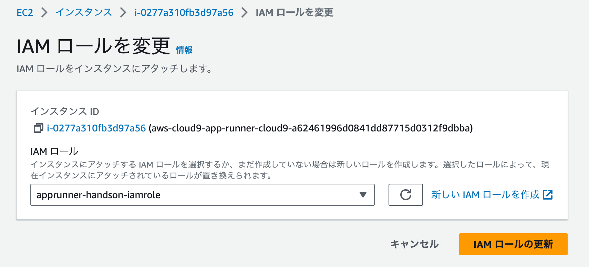

# IAMロールの作成

ここでは、Cloud9ワークスペースの作業に必要な権限を付与するために、IAMロールの作成とアタッチを行います。

https://us-east-1.console.aws.amazon.com/iamv2/home?region=ap-northeast-1#/home

## IAMロールの作成

- AWSマネジメントコンソールから、Cloud9のページに遷移します。
    - https://us-east-1.console.aws.amazon.com/iamv2/home?region=ap-northeast-1
- 左側メニューの「ロール」をクリックし、「ロールの作成」をクリックします。

- 信頼されたエンティティタイプは「AWSのサービス」、ユースケースは「EC2」が選択されていることを確認し、「次へ」をクリックします。

- 今回は「AdministratorAccess」にチェックを入れ、「次へ」をクリックします。

- ロール名を適宜入力したら、「ロールの作成」をクリックします。

- ロールが作成されたことを確認します。

## Cloud9ワークスペースEC2インスタンスにアタッチ

- Cloud9ワークスペース右上の丸い灰色ボタンをクリックし、「Manage EC2 Instance」をクリックします。
    - それ以外にも、マネジメントコンソール上からEC2インスタンス管理を辿ってもOKです。

- 表示されているEC2インスタンスの左側チェックボックスにチェックを入れ、「アクション」「セキュリティ」「IAMロールを変更」の順でクリックします。

- 先ほど作成したIAMロールを選択して、「IAMロールの更新」をクリックします。

これで事前の準備は整いました。

次の章で、実際にAWS App Runnerを使っていきましょう。
