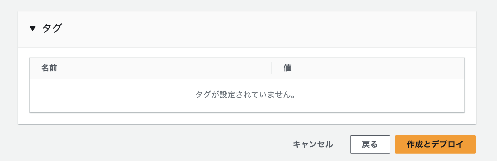
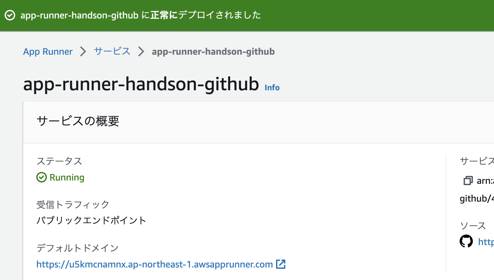

# GitHubを使ってWebサイトをApp Runnerにデプロイしよう

この章では、AWS App Runnerにアプリケーションをデプロイする方法の1つである、
GitHubから直接アプリケーションをデプロイする方法を行います。

## デプロイ対象アプリケーション

まずはシンプルなNode.js Webアプリケーションを作成して、シンプルなWebページをApp Runnerで動かしてみましょう。

Webアプリケーションには以下のファイルがあります。

- `index.js`
    - Node.jsで動作するWebアプリケーション本体
- `package.json`
    - Node.jsのライブラリ管理

これらのファイルをビルドして、必要なライブラリをインストールします。
アプリケーションをビルドするために、App Runnerで `yarn install` コマンド等を実行するように設定します。

## アプリケーションをGitHubに登録

今回のアプリケーションのソースコードは以下のGitHubリポジトリに格納しています。

https://github.com/kasacchiful/app-runner-handson-simple-web-app

各自のGitHubアカウントに新規リポジトリを作成して、上記リポジトリから `index.js` と `package.json` をコピーしてリポジトリに登録することでも対応できますが、今回は上記リポジトリをフォークして利用したいと思います。

- 上記リポジトリから、「fork」「Create a new fork」をクリックします。

- Ownerを適宜選択して「Create fork」をクリックします。

各自のGitHubアカウントに上記リポジトリがフォークできたらOKです。

## App Runnerの設定

では、App Runnerの設定を行って、Webアプリケーションを起動しましょう。

https://ap-northeast-1.console.aws.amazon.com/apprunner/home?region=ap-northeast-1

- App Runnerの画面から、「App Runnerサービスを作成」をクリックします。

- 以下の設定を行います
    - リポジトリタイプ: ソースコードリポジトリ
    - GitHubに接続:
        - 「新規作成」をクリックします
            
        - 「Authorize AWS Connector for GitHub」をクリックします。
            
        - 接続名は適宜設定します。
        - GitHubアプリケーションは空だと思いますので、「別のアプリケーションをインストールする」をクリックします。
            
        - 適宜アカウントを選択して進めます。
            
        - 対象リポジトリがあるGitHubアカウントが表示されたら「次へ」をクリックします。
            
        - 元の画面に戻ります。「リポジトリ」と「ブランチ」が選択できるようになっていますので、先ほどフォークしたリポジトリとmainブランチを適宜設定します。
            
    - デプロイ設定: 「自動」を選択
        
    - 各種設定したら「次へ」をクリックします。
        

- 構成設定は以下の通りにします。
    - 設定ファイル:
        「ここですべての設定を構成する」を選択します。
    - ランタイム: 「Nodejs 16」を選択します。
    - 構築コマンド: `yarn install` を入力します。
    - 開始コマンド: `node index.js` を入力します。
    - ポート: `3000` を入力します。
    - 「次へ」をクリックします。

- サービス設定は以下の通りにします。
    - サービス名: 適宜設定します
    - その他デフォルト設定でそのまま「次へ」をクリックします。

- 設定内容を確認して、「作成とデプロイ」をクリックします。

- デプロイが完了するまで、しばらく待ちます

- ステータスが「Running」になったら、デフォルトドメインのURLをクリックします。

- ブラウザに「Hello World」が表示されればOKです。

