# Dockerを使ってWebサイトをApp Runnerにデプロイしよう

この章では、AWS App Runnerにアプリケーションをデプロイする方法の1つである、
Dockerコンテナを利用してデプロイする方法を行います。

## ソースコードをCloud9へコピー

Cloud9のIDEを起動しましょう。

以下のGitHubリポジトリにソースコードがありますので、このソースをCloneします。

https://github.com/kasacchiful/app-runner-handson-docker-app

```bash
git clone https://github.com/kasacchiful/app-runner-handson-docker-app
```

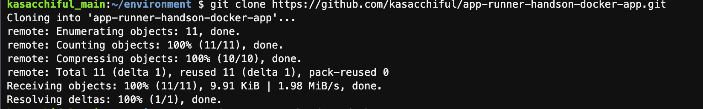

クローンしたら、該当ディレクトリに移動しておきましょう。

```bash
cd app-runner-handson-docker-app
```

## ECRの設定

App RunnerにDockerコンテナを利用してデプロイする場合、コンテナイメージをAmazon ECRに登録する必要があります。

https://ap-northeast-1.console.aws.amazon.com/ecr/get-started?region=ap-northeast-1

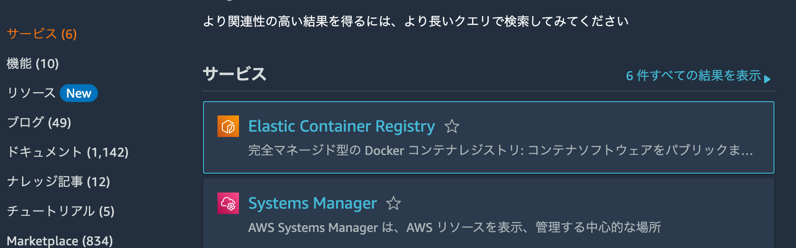

- 「リポジトリの作成」の「使用方法」をクリックします。

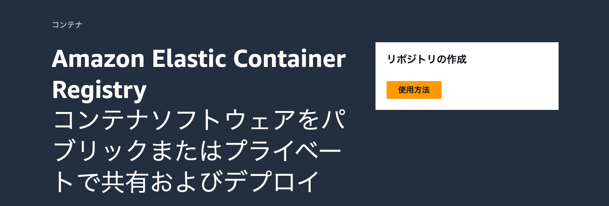

- 以下の設定を行います。
    - 可視性設定: プライベート (デフォルト)
    - リポジトリ名: `app-runner-handson-docker-app` とします。
- 「リポジトリを作成」をクリックします。

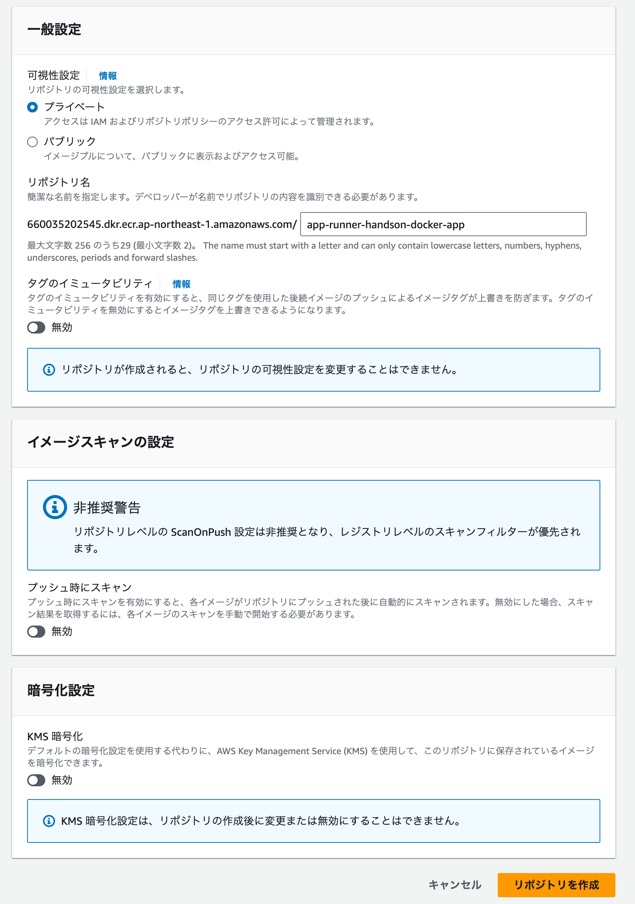

- リポジトリが作成されたら、「プッシュコマンドの表示」ボタンをクリックします。

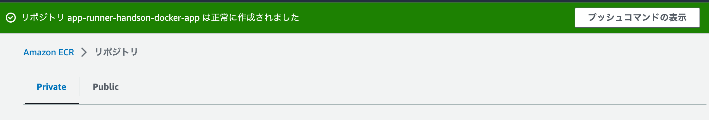

- CLIでリポジトリにプッシュするコマンド一覧が表示されます。このコマンドを使ってコンテナイメージを登録します。

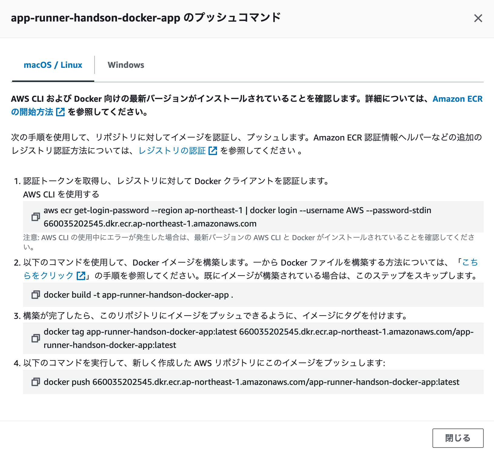


## ECRにコンテナイメージを登録

Cloud9のIDEに戻り、Dockerfileがあるディレクトリ上で、以下のコマンドを実行します。

```bash
aws ecr get-login-password --region ap-northeast-1 | docker login --username AWS --password-stdin ＜AWSアカウントID＞.dkr.ecr.ap-northeast-1.amazonaws.com
```

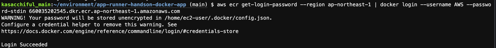

```bash
docker build -t app-runner-handson-docker-app .
```

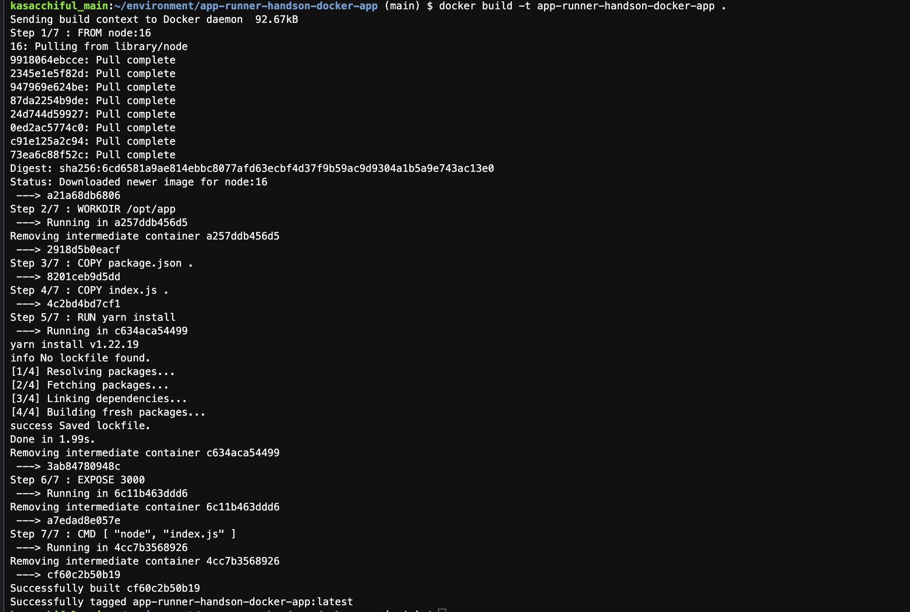

```bash
docker tag app-runner-handson-docker-app:latest ＜AWSアカウントID＞.dkr.ecr.ap-northeast-1.amazonaws.com/app-runner-handson-docker-app:latest
```

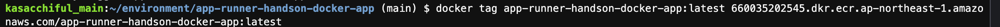

```bash
docker push ＜AWSアカウントID＞.dkr.ecr.ap-northeast-1.amazonaws.com/app-runner-handson-docker-app:latest
```

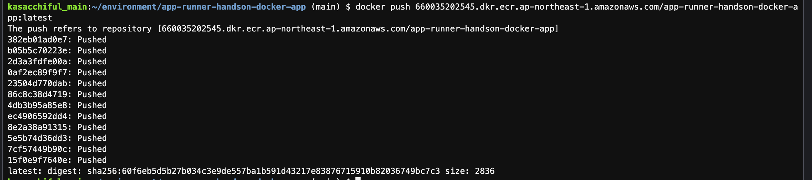

ECRにコンテナイメージが登録できたら、作成したリポジトリ名をクリックし、「イメージのURI」の「URIのコピー」アイコンをクリックしましょう。

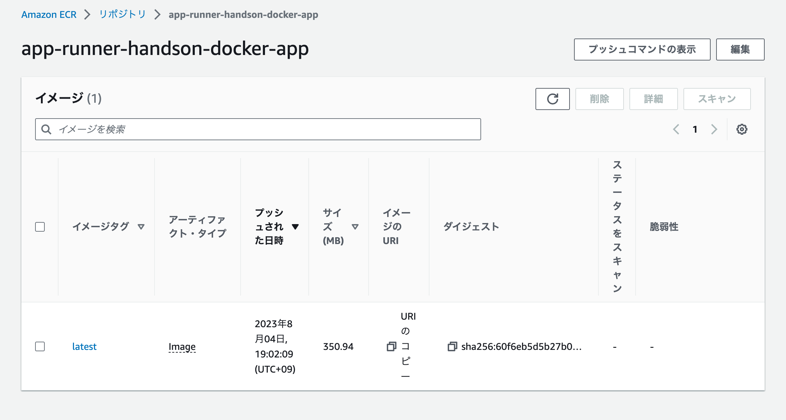

以下のようなURI文字列がコピーされます。App Runnerの設定で使いますので、コピーを取っておきましょう。

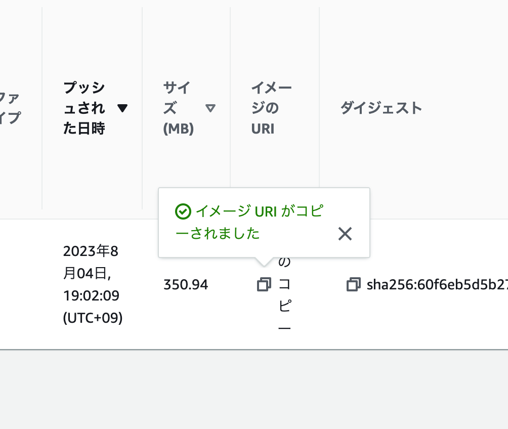

```txt
＜AWSアカウントID＞.dkr.ecr.ap-northeast-1.amazonaws.com/app-runner-handson-docker-app:latest
```

## App Runnerの設定

では、App Runnerの設定を行って、Webアプリケーションを起動しましょう。

https://ap-northeast-1.console.aws.amazon.com/apprunner/home?region=ap-northeast-1

- App Runnerの画面から、「サービスの作成」をクリックします。

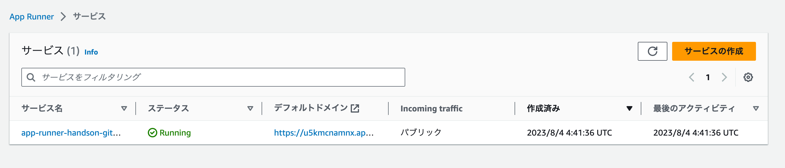

- 以下の設定を行います。
    - リポジトリタイプ: コンテナレジストリ
    - プロバイダー: Amazon ECR
    - コンテナのイメージURI: 先ほどコピーを取得したイメージURI文字列
        ```txt
        ＜AWSアカウントID＞.dkr.ecr.ap-northeast-1.amazonaws.com/app-runner-handson-docker-app:latest
        ```
    - デプロイトリガー: 手動
    - ECRアクセスロール: 「新しいサービスロールの作成」を選択
        - サービスロール名はデフォルトのままでOK

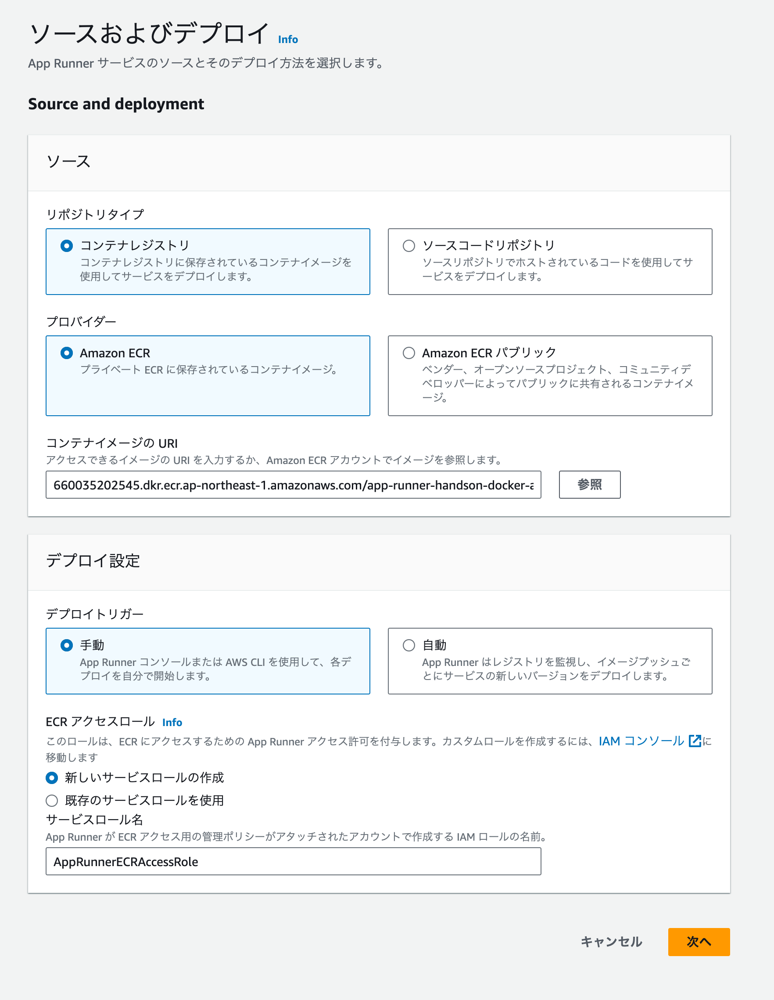

- サービス設定は以下の通りにします。
    - サービス名: 適宜設定します
    - ポート: `3000` を入力します。
    - その他デフォルト設定でそのまま「次へ」をクリックします。

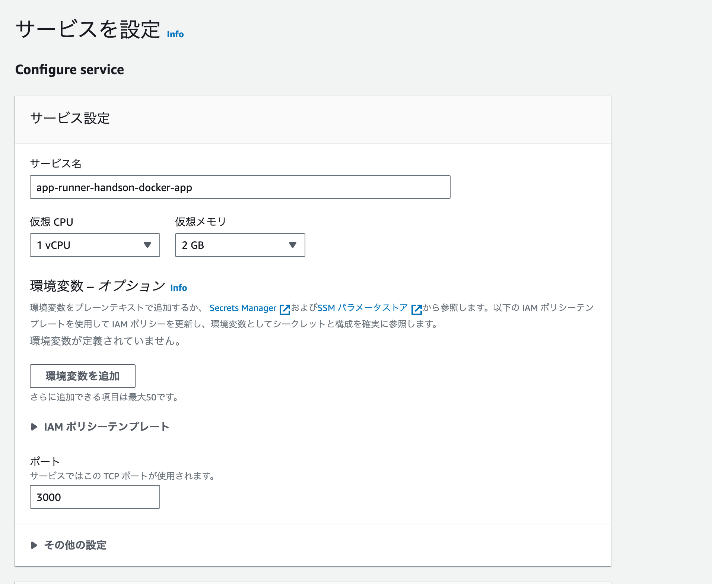

- 設定内容を確認して、「作成とデプロイ」をクリックします。

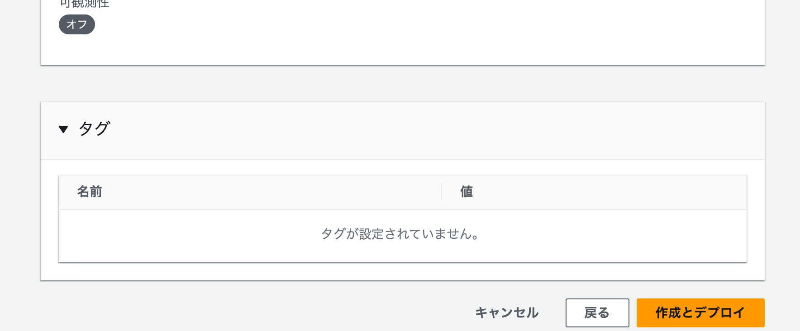

- デプロイが完了するまで、しばらく待ちます

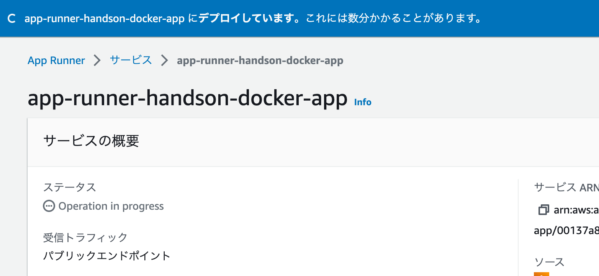

- ステータスが「Running」になったら、デフォルトドメインのURLをクリックします。

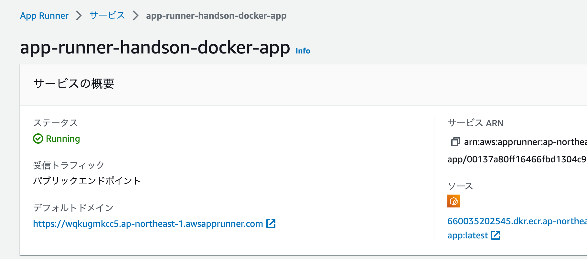

- ブラウザに「Hello World」が表示されればOKです。


