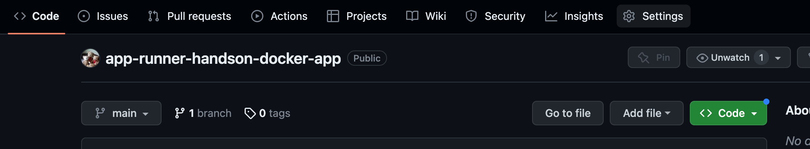

# リソースを削除する

最後に、各種AWSリソースを削除して後片付けをしましょう。

## App Runner サービスの削除

今回作成したApp Runnerサービスを1つずつ削除します。

## ECRリポジトリの削除

今回作成したECRリポジトリを削除します。
左側のチェックボックスにチェックを入れ、「削除」ボタンをクリックします。

## Cloud9環境の削除

IDEはブラウザを閉じても大丈夫です。

今回作成したCloud9環境を削除します。
左側のラジオボタンを選択し、「削除」ボタンをクリックします。

## IAMロールの削除

最初に作成したIAMロールと、ECRでデプロイした際に作成したIAMロールを削除します。

## GitHubリポジトリの削除

フォークしたGitHubリポジトリは、削除してもかまいません。

「Settings」から「Delete this Repository」をクリックすると、リポジトリを削除できます。

以上です。
お疲れ様でした。
